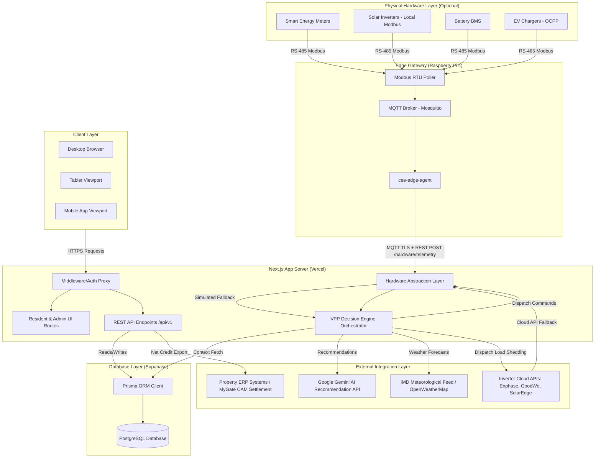

# System Architecture

This document details the architectural design, VPP orchestrator mechanisms, decision engines, and data flow of the Community Energy Exchange AI (CEE-AI) platform.

---

## 🏗️ System Overview

CEE-AI is a **hardware-optional** Virtual Power Plant (VPP) designed to coordinate residential solar generators and battery storage into a unified virtual microgrid. The system is structured around a **Hardware Abstraction Layer (HAL)** that automatically selects the best available data source:

1. **MQTT_EDGE** — Physical hardware (smart meters, inverters, BMS) connected via an on-premises Raspberry Pi edge gateway
2. **CLOUD_API** — Inverter cloud APIs (Enphase Enlighten, SolarEdge Monitoring, GoodWe SEMS)
3. **SIMULATED** — Mock-store fallback for offline demos and development

This layered approach means the software works without any physical hardware and automatically upgrades to real hardware data when an edge gateway comes online. See [`hardware/docs/OVERVIEW.md`](hardware/docs/OVERVIEW.md) for the full hardware architecture.



---

## ⚡ VPP Orchestrator & AI Decision Engine

The core scheduling and routing decisions are made by the **Decision Engine Orchestrator** in `src/lib/ai/decision-engine.ts`. Every dispatch interval (typically 15 minutes), the engine gathers real-time telemetry from all connected homes and coordinates three specialized subsystems:

```
                  +--------------------------------+
                  |  Real-time Home Telemetry Info  |
                  +----------------+---------------+
                                   |
                                   v
                  +----------------+---------------+
                  |  Decision Engine Orchestrator  |
                  +----------------+---------------+
                                   |
         +-------------------------+-------------------------+
         |                         |                         |
         v                         v                         v
+--------+--------+       +--------+--------+       +--------+--------+
| Weather Intel   |       | Emergency prior |       | Energy Routing  |
| Storm warning,  |       | 4-Tier Medical  |       | Net supplier-   |
| Precharge commands      | load shedding   |       | consumer solver |
+-----------------+       +-----------------+       +-----------------+
```

### 1. Weather Intelligence (`weather-intelligence.ts`)
- Continuously monitors precipitation, wind speed, and meteorological storm alerts.
- Evaluates outage probability $P(\text{Outage})$.
- If $P(\text{Outage}) > 0.65$, triggers a proactive `FORCE_CHARGE` command to override grid export and pre-charge all community batteries to 100% state of charge (SOC).

### 2. Emergency Prioritization (`emergency-prioritization.ts`)
- In the event of a grid blackout, the platform overrides standard commercial dispatch and locks into **Emergency Triage Mode**.
- Activates a deterministic 4-tier load shedding hierarchy:
  - **Tier 0 (Medical)**: Oxygen concentrators, ventilators, dialyzers. Minimum 30% SOC reserve floor strictly locked.
  - **Tier 1 (Lifeline)**: Water pumps, elevators, community alarms.
  - **Tier 2 (Basic)**: Fans, basic lighting.
  - **Tier 3 (Deferrable)**: EV chargers, split AC units, heavy pool pumps. Instantly throttled/shed to 0 kW to preserve neighbor reserves.

### 3. Energy Routing Solver (`energy-routing.ts`)
- Formulates optimal routing plans between surplus homes (net energy exporters) and deficit homes (exporters/consumers).
- Solves a transportation optimization problem matching local generation to vital medical/domestic loads before exporting any residual power to the main utility grid.

---

## ⚡ Hardware Abstraction Layer

The HAL in `src/lib/hardware/hal.ts` isolates all physical hardware concerns from the AI and API layers. It implements a **priority-ordered source selector**:

```
┌───────────────────────────────────────────────┐
│         HAL Source Selection Logic                    │
│                                                         │
│   Priority 1: MQTT_EDGE                                │
│     Physical smart meters / BMS / inverters             │
│     via Raspberry Pi edge gateway                       │
│     ↓ (if offline)                                      │
│   Priority 2: CLOUD_API                                 │
│     Enphase / SolarEdge / GoodWe cloud polling          │
│     ↓ (if unavailable)                                  │
│   Priority 3: SIMULATED                                 │
│     mock-store.ts fallback (dev / demo)                 │
└───────────────────────────────────────────────┘
```

Hardware components are fully documented in [`hardware/docs/COMPONENTS.md`](hardware/docs/COMPONENTS.md).

New API surface for hardware:
- `POST /api/v1/hardware/telemetry` — Edge gateway pushes batch readings
- `GET /api/v1/hardware/status` — Dashboard and gateway query connectivity
- `POST /api/v1/hardware/heartbeat` — Gateway health pings
- `POST /api/v1/hardware/dispatch` — Manual dispatch commands (admin only)

---

## 📊 Relational Database Schema & Data Models

CEE-AI uses Supabase PostgreSQL managed through Prisma ORM (`prisma/schema.prisma`).

```mermaid
erDiagram
    Community ||--o{ Home : contains
    Community ||--o{ HardwareDevice : has
    Home ||--o{ Inverter : owns
    Home ||--o{ EnergyTelemetry : tracks
    Home ||--o{ LedgerTransaction : records
    Home ||--o{ MonthlySettlement : settles
    Home ||--o{ HardwareDevice : has
    HardwareDevice ||--o{ EnergyTelemetry : sources
    HardwareDevice ||--o{ HardwareHealthLog : logs

    Community {
        string id PK
        string rwa_name
        string rwa_code
        string city
        string state
        float grid_tariff_inr
        float dg_tariff_inr
        float clearing_rate_inr
    }

    Home {
        string id PK
        string community_id FK
        string resident_name
        string mygate_flat_id
        string emergency_tier "TIER_0 | TIER_1 | TIER_2 | TIER_3"
        int min_soc_reserve_pct
        boolean has_solar
        boolean has_battery
        boolean has_ev
    }

    Inverter {
        string id PK
        string home_id FK
        string oem_provider "ENPHASE | GOODWE | SOLAREDGE"
        string serial_number
        float nameplate_capacity_kw
        float max_export_kw
        boolean is_active
        string auth_credentials_enc
    }

    EnergyTelemetry {
        datetime time PK
        string home_id PK FK
        float solar_gen_kw
        float battery_soc_pct
        float battery_flow_kw
        float home_demand_kw
        float grid_import_kw
        float grid_export_kw
        string grid_status "NORMAL | OUTAGE_DG_ACTIVE | CYCLONE_ALERT"
        string telemetry_source "MQTT_EDGE | CLOUD_API | SIMULATED | MANUAL"
        string hardware_device_id FK
    }

    HardwareDevice {
        string id PK
        string community_id FK
        string home_id FK
        string gateway_id
        string device_type "EDGE_GATEWAY | SMART_METER | SOLAR_INVERTER | BATTERY_BMS | EV_CHARGER"
        string label
        int modbus_address
        string status "ONLINE | OFFLINE | STALE | FAULT | SIMULATED"
        string firmware_version
        datetime last_seen_at
    }

    HardwareHealthLog {
        string id PK
        string hardware_device_id FK
        string event_type "HEARTBEAT | DEVICE_OFFLINE | BMS_FAULT | VOLTAGE_SAG"
        string severity "INFO | WARNING | ERROR | CRITICAL"
        int modbus_devices_online
        int modbus_devices_total
        int uptime_seconds
        float temperature_c
        json details
    }

    LedgerTransaction {
        string id PK
        string home_id FK
        datetime interval_start
        datetime interval_end
        float energy_given_kwh
        float energy_received_kwh
        float net_energy_balance_kwh
        float clearing_rate_inr
        float net_value_inr
        string audit_signature
    }

    MonthlySettlement {
        string id PK
        string community_id FK
        string home_id FK
        int billing_year
        int billing_month
        float total_energy_given_kwh
        float total_energy_received_kwh
        float net_energy_balance_kwh
        float cam_bill_adjustment_inr
        float dg_liters_saved_equivalent
        string status "DRAFT | CLOSED_EXPORTED"
    }
```

### Double-Entry Ledger Netting System
- Every 15 minutes, local exports and imports are netted.
- Net providers accumulate positive credits (which subtract from their monthly RWA CAM maintenance bill).
- Net consumers accumulate negative debits (which add to their CAM bill).
- All transactions are cryptographically signed to form an immutable ledger audit trail.

---

## 🔒 Security & Data Encryption

1. **Inverter Credentials**: Inverters communicate via OAuth2 tokens. Access and refresh tokens are encrypted using `AES-256-GCM` before being written to the database.
2. **Auth Proxy Middleware**: `src/proxy.ts` performs server-side JWT session validation using Supabase Auth SSR. It strictly protects dashboard routes (`/dashboard/*`) from unauthorized viewports.
3. **Emergency Override Resilience**: The prioritization modules run entirely locally on serverless functions without dependency on LLM performance, guaranteeing fail-safe triage operations under all weather conditions.
4. **Hardware JWT Authentication**: Edge gateways authenticate to the hardware API endpoints using a pre-provisioned HMAC JWT signed with `HARDWARE_EDGE_JWT_SECRET`. Credentials are separate from user session JWTs.
5. **Dispatch Command Safety Constraints**: The HAL validates all dispatch commands before transmission — power limits, SOC floors, and command expiry are enforced in software (`src/lib/hardware/hal.ts`) independently of the edge gateway.
6. **Hardware Installation Safety**: All high-voltage electrical work (smart meters, inverters, BESS) requires licensed electricians. See [`hardware/docs/SAFETY.md`](hardware/docs/SAFETY.md) for complete safety requirements.
