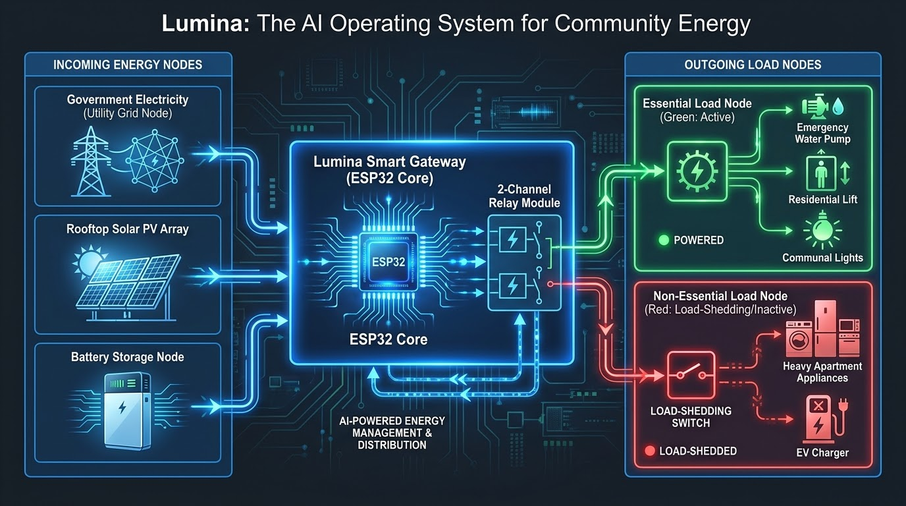

---

#markdown
# ⚡ Lumina: AI Operating System for Community Energy
## 📐 Hardware Architecture, Pinout Mapping, Firmware, Python Simulator & Backend API Specification

---

## 🖼️ System Architecture Diagrams & Circuit References

* **Lumina Gateway Circuit Diagram:** [

* **Hardware Schematic V2 Diagram:** [](#)

---

## 🧠 Controller Processor & Hardware Architecture

### **Core Processor Specs**
* [cite_start]**Processor Core:** ESP32 DevKit V4 Module [cite: 255]
* [cite_start]**Microprocessor:** Tensilica Xtensa® Dual-Core 32-bit LX6 Microprocessor [cite: 255]
* [cite_start]**Clock Frequency:** Up to 240 MHz [cite: 255]
* [cite_start]**SRAM:** 520 KB [cite: 255]
* [cite_start]**Flash Memory:** 4 MB / 8 MB SPI Flash [cite: 255]
* [cite_start]**Wireless Connectivity:** 2.4 GHz Wi-Fi (802.11 b/g/n) + Bluetooth v4.2 BR/EDR & BLE [cite: 255]
* [cite_start]**Analog Inputs (ADC):** 12-bit SAR ADC (up to 18 channels) [cite: 255]
* [cite_start]**Peripherals:** I2C (GPIO 21/22), SPI, UART, PWM, Capacitive Touch Pins [cite: 255]

---

## 🏗️ System Visual Pin Diagram (Mermaid.js)

```mermaid
graph TD
    %% Custom Styling
    classDef espStyle fill:#4A148C,stroke:#333,stroke-width:2px,color:#fff;
    classDef inputStyle fill:#1565C0,stroke:#333,stroke-width:1px,color:#fff;
    classDef outputStyle fill:#2E7D32,stroke:#333,stroke-width:1px,color:#fff;
    classDef displayStyle fill:#00838F,stroke:#333,stroke-width:1px,color:#fff;
    classDef backendStyle fill:#D84315,stroke:#333,stroke-width:1px,color:#fff;

    %% ESP32 Core Processor
    subgraph ESP32 ["ESP32 Microcontroller Core"]
        ESP32_MCU["ESP32 DevKit V4 Core"]:::espStyle
    end

    %% Incoming Telemetry Nodes
    subgraph INPUTS ["Incoming Telemetry Energy Nodes"]
        GRID["Utility Grid Switch<br/>(Government Electricity Node)"]:::inputStyle
        POT["Battery SoC Sensor<br/>(10kΩ Potentiometer)"]:::inputStyle
        LDR["Solar PV Irradiance Sensor<br/>(LDR Module)"]:::inputStyle
    end

    %% Local Telemetry Display
    subgraph DISPLAY ["Local Telemetry & Interface"]
        LCD["16x2 I2C LCD Display Module"]:::displayStyle
    end

    %% Outgoing Load Control
    subgraph OUTPUTS ["Outgoing Load Nodes"]
        RELAY1["Relay 1: Essential Load Switch"]:::outputStyle
        RELAY2["Relay 2: Non-Essential Load Switch"]:::outputStyle
        LED_GREEN["Essential Load Node<br/>(Green LED: Pumps / Lifts)"]:::outputStyle
        LED_RED["Non-Essential Load Node<br/>(Red LED: Heavy Appliances / EV)"]:::outputStyle
    end

    %% Cloud / Python API Interface
    subgraph BACKEND ["Cloud AI Engine & Web Dashboard"]
        API["Python REST API / Telemetry Gateway"]:::backendStyle
        SIM["Python Energy Simulator"]:::backendStyle
    end

    %% Signal Connections
    GRID -- "Digital Signal -> GPIO 13" --> ESP32_MCU
    POT -- "Analog Input (ADC1) -> GPIO 34" --> ESP32_MCU
    LDR -- "Analog Input (ADC1) -> GPIO 35" --> ESP32_MCU

    ESP32_MCU -- "I2C SDA -> GPIO 21" --> LCD
    ESP32_MCU -- "I2C SCL -> GPIO 22" --> LCD

    ESP32_MCU -- "Relay Control Signal -> GPIO 18" --> RELAY1
    ESP32_MCU -- "Relay Control Signal -> GPIO 19" --> RELAY2

    RELAY1 -- "NO Terminal -> 220Ω" --> LED_GREEN
    RELAY2 -- "NO Terminal -> 220Ω" --> LED_RED

    %% API Data Flow
    ESP32_MCU == "Wi-Fi HTTP POST Telemetry" ==> API
    SIM == "Simulated Data Feed" ==> API
    API -. "Optimization Rules / Overrides" .-> ESP32_MCU

    %% Power Connections
    ESP32_MCU -- "3.3V Power Rail" --> GRID
    ESP32_MCU -- "3.3V Power Rail" --> POT
    ESP32_MCU -- "3.3V Power Rail" --> LDR

    ESP32_MCU -- "5V Power Rail" --> LCD
    ESP32_MCU -- "5V Power Rail" --> RELAY1
    ESP32_MCU -- "5V Power Rail" --> RELAY2

    ESP32_MCU -- "Common Ground (GND)" --> GRID
    ESP32_MCU -- "Common Ground (GND)" --> POT
    ESP32_MCU -- "Common Ground (GND)" --> LDR
    ESP32_MCU -- "Common Ground (GND)" --> LCD
    ESP32_MCU -- "Common Ground (GND)" --> RELAY1
    ESP32_MCU -- "Common Ground (GND)" --> RELAY2
    ESP32_MCU -- "Common Ground (GND)" --> LED_GREEN
    ESP32_MCU -- "Common Ground (GND)" --> LED_RED
```



---

## 📦 Bill of Materials (Component List)

| Component Name | Quantity | Specifications | Functional Role in System |
| :--- | :---: | :--- | :--- |
| **ESP32 DevKit V4** | 1 | [cite_start]Xtensa Dual-Core LX6, 240MHz, Wi-Fi/BLE [cite: 255] | [cite_start]Central IoT Smart Gateway Controller [cite: 213] |
| **Slide Switch** | 1 | SPDT / Single Pole Toggle Switch | [cite_start]Simulates Utility Grid (Government Electricity) State [cite: 214] |
| **Rotary Potentiometer** | 1 | 10kΩ Linear Potentiometer | [cite_start]Simulates Battery State of Charge (SoC $0-100\%$) [cite: 215] |
| **LDR Light Sensor Module** | 1 | Photoresistor with analog comparator | [cite_start]Simulates Rooftop Solar PV generation capacity [cite: 216] |
| **16x2 I2C LCD Module** | 1 | HD44780 + PCF8574 I2C Adapter | [cite_start]Displays grid telemetry, SoC %, and load shedding status [cite: 217] |
| **5V 2-Channel Relay Board** | 1 | 5V Coil with Optocoupler Isolation | [cite_start]Switches power to Essential and Non-Essential circuits [cite: 218] |
| **220Ω Resistors** | 2 | 1/4W Carbon Film Resistors | [cite_start]Current limiting resistors for indicator LEDs [cite: 219] |
| **Green LED** | 1 | 5mm Standard Diffused LED | [cite_start]Status indicator for Essential Load Node (Active) [cite: 220] |
| **Red LED** | 1 | 5mm Standard Diffused LED | [cite_start]Status indicator for Non-Essential Load Node (Shedded) [cite: 221] |
| **Jumper Wires & Breadboard** | -- | Male-to-Male / Male-to-Female | [cite_start]Circuit interconnection rail [cite: 222] |

---

## 📌 Pin Assignment & Hardware Wiring Table

| Component Name | Pin Name | ESP32 Pin Connection | Signal Type | Description & Purpose |
| :--- | :--- | :--- | :--- | :--- |
| **Utility Grid Switch** | Pin 1 (GND) | `GND` | Ground | [cite_start]System reference ground [cite: 225] |
| | Pin 2 (Signal) | `GPIO 13` | Digital Input | [cite_start]Read grid online (`HIGH`) or cut (`LOW`) [cite: 226] |
| | Pin 3 (VCC) | `3.3V` | Power | [cite_start]Logic high voltage reference [cite: 227] |
| **Battery SoC Potentiometer** | Pin 1 (GND) | `GND` | Ground | [cite_start]Voltage divider ground [cite: 228] |
| | Pin 2 (SIG) | `GPIO 34` | Analog Input (`ADC1_CH6`) | [cite_start]Battery State of Charge ($0 - 4095 \rightarrow 0 - 100\%$) [cite: 229] |
| | Pin 3 (VCC) | `3.3V` | Power | [cite_start]Voltage divider 3.3V reference [cite: 230] |
| **Solar PV LDR Sensor** | GND Pin | `GND` | Ground | [cite_start]Sensor ground reference [cite: 231] |
| | VCC Pin | `3.3V` | Power | [cite_start]Sensor supply voltage [cite: 232] |
| | AO Pin | `GPIO 35` | Analog Input (`ADC1_CH7`) | [cite_start]Solar irradiance level ($0 - 4095 \rightarrow 0 - 100\%$) [cite: 233] |
| **16x2 I2C LCD Display** | GND Pin | `GND` | Ground | [cite_start]Display ground reference [cite: 234] |
| | VCC Pin | `5V / VIN` | Power | [cite_start]5V supply rail for LCD backlight [cite: 235] |
| | SDA Pin | `GPIO 21` | I2C Data | [cite_start]Serial Data channel for telemetry [cite: 236] |
| | SCL Pin | `GPIO 22` | I2C Clock | [cite_start]Serial Clock channel for telemetry [cite: 237] |
| **Relay 1 (Essential)** | VCC / GND | `5V` / `GND` | Power | [cite_start]5V relay module coil supply [cite: 238] |
| | IN Pin | `GPIO 18` | Digital Output | [cite_start]Control line for essential load [cite: 238] |
| | NO Terminal | $\rightarrow 220\Omega \rightarrow$ Green LED (+) | Switched Power | [cite_start]Powers water pumps, elevators, emergency lighting [cite: 239, 240] |
| **Relay 2 (Non-Essential)** | VCC / GND | `5V` / `GND` | Power | [cite_start]5V relay module coil supply [cite: 241, 242] |
| | IN Pin | `GPIO 19` | Digital Output | [cite_start]Control line for non-essential load [cite: 241, 242] |
| | NO Terminal | $\rightarrow 220\Omega \rightarrow$ Red LED (+) | Switched Power | [cite_start]Controls heavy appliances, EV chargers (Load Shedded) [cite: 243] |

---

## ⚡ Direct Point-to-Point Connection Checklist

- [ ] **1. [cite_start]Utility Grid Sensing Switch** [cite: 245]
  - [cite_start]Pin 1 (Left) $\rightarrow$ `ESP32 GND` [cite: 245]
  - [cite_start]Pin 2 (Middle) $\rightarrow$ `ESP32 GPIO 13` [cite: 245]
  - [cite_start]Pin 3 (Right) $\rightarrow$ `ESP32 3.3V` [cite: 245]

- [ ] **2. [cite_start]Battery State of Charge Potentiometer** [cite: 245]
  - [cite_start]Pin 1 (GND) $\rightarrow$ `ESP32 GND` [cite: 246]
  - [cite_start]Pin 2 (SIG) $\rightarrow$ `ESP32 GPIO 34` [cite: 246]
  - [cite_start]Pin 3 (VCC) $\rightarrow$ `ESP32 3.3V` [cite: 246]

- [ ] **3. [cite_start]Solar PV LDR Sensor Module** [cite: 246]
  - [cite_start]GND Pin $\rightarrow$ `ESP32 GND` [cite: 246]
  - [cite_start]VCC Pin $\rightarrow$ `ESP32 3.3V` [cite: 247]
  - [cite_start]AO Pin $\rightarrow$ `ESP32 GPIO 35` [cite: 247]

- [ ] **4. [cite_start]16x2 I2C LCD Display Module** [cite: 247]
  - [cite_start]GND Pin $\rightarrow$ `ESP32 GND` [cite: 247]
  - [cite_start]VCC Pin $\rightarrow$ `ESP32 5V` [cite: 247]
  - [cite_start]SDA Pin $\rightarrow$ `ESP32 GPIO 21` [cite: 247]
  - [cite_start]SCL Pin $\rightarrow$ `ESP32 GPIO 22` [cite: 247]

- [ ] **5. [cite_start]Relay 1 (Essential Load Channel)** [cite: 248]
  - [cite_start]VCC Pin $\rightarrow$ `ESP32 5V` [cite: 248]
  - [cite_start]GND Pin $\rightarrow$ `ESP32 GND` [cite: 248]
  - [cite_start]IN Pin $\rightarrow$ `ESP32 GPIO 18` [cite: 248]
  - [cite_start]COM Terminal $\rightarrow$ `5V Power Rail` [cite: 248]
  - [cite_start]NO Terminal $\rightarrow$ `220Ω Resistor` $\rightarrow$ `Green LED (+ Anode)` [cite: 248]
  - [cite_start]Green LED (- Cathode) $\rightarrow$ `ESP32 GND` [cite: 249]

- [ ] **6. [cite_start]Relay 2 (Non-Essential Load Channel)** [cite: 249]
  - [cite_start]VCC Pin $\rightarrow$ `ESP32 5V` [cite: 249]
  - [cite_start]GND Pin $\rightarrow$ `ESP32 GND` [cite: 249]
  - [cite_start]IN Pin $\rightarrow$ `ESP32 GPIO 19` [cite: 249]
  - [cite_start]COM Terminal $\rightarrow$ `5V Power Rail` [cite: 249]
  - [cite_start]NO Terminal $\rightarrow$ `220Ω Resistor` $\rightarrow$ `Red LED (+ Anode)` [cite: 249, 250]
  - [cite_start]Red LED (- Cathode) $\rightarrow$ `ESP32 GND` [cite: 250]

---

## 📄 Wokwi Simulator Configuration (`diagram.json`)

```json
{
  "version": 1,
  "author": "Lumina AI OS",
  "editor": "wokwi",
  "parts": [
    { "type": "board-esp32-devkit-c-v4", "id": "esp", "top": 100, "left": 180, "attrs": {} },
    { 
      "type": "wokwi-lcd1602", 
      "id": "lcd", 
      "top": -120, 
      "left": 140, 
      "attrs": { "pins": "i2c", "label": "Lumina Telemetry Display" } 
    },
    { 
      "type": "wokwi-slide-switch", 
      "id": "grid_sw", 
      "top": -30, 
      "left": -120, 
      "attrs": { "label": "Utility Grid Node" } 
    },
    { 
      "type": "wokwi-potentiometer", 
      "id": "pot", 
      "top": 100, 
      "left": -120, 
      "attrs": { "label": "Battery SoC (%)" } 
    },
    { 
      "type": "wokwi-photoresistor-sensor", 
      "id": "ldr", 
      "top": 250, 
      "left": -120, 
      "attrs": { "label": "Solar PV Input" } 
    },
    { 
      "type": "wokwi-relay-module", 
      "id": "relay1", 
      "top": 50, 
      "left": 480, 
      "attrs": { "label": "Relay 1: Essential Load Switch" } 
    },
    { 
      "type": "wokwi-relay-module", 
      "id": "relay2", 
      "top": 210, 
      "left": 480, 
      "attrs": { "label": "Relay 2: Non-Essential Load Switch" } 
    },
    { 
      "type": "wokwi-resistor", 
      "id": "r1", 
      "top": 90, 
      "left": 660, 
      "attrs": { "value": "220" } 
    },
    { 
      "type": "wokwi-resistor", 
      "id": "r2", 
      "top": 250, 
      "left": 660, 
      "attrs": { "value": "220" } 
    },
    { 
      "type": "wokwi-led", 
      "id": "led_essential", 
      "top": 80, 
      "left": 760, 
      "attrs": { "color": "green", "label": "Essential Load Node (Water Pump/Lifts)" } 
    },
    { 
      "type": "wokwi-led", 
      "id": "led_nonessential", 
      "top": 240, 
      "left": 760, 
      "attrs": { "color": "red", "label": "Non-Essential Load Node (Appliances/EV)" } 
    }
  ],
  "connections": [
    [ "esp:GND.1", "lcd:GND", "black", [ "v0" ] ],
    [ "esp:5V", "lcd:VCC", "red", [ "v0" ] ],
    [ "esp:21", "lcd:SDA", "green", [ "v0" ] ],
    [ "esp:22", "lcd:SCL", "blue", [ "v0" ] ],

    [ "esp:GND.1", "grid_sw:1", "black", [ "v0" ] ],
    [ "esp:13", "grid_sw:2", "yellow", [ "v0" ] ],
    [ "esp:3V3", "grid_sw:3", "red", [ "v0" ] ],

    [ "esp:3V3", "pot:VCC", "red", [ "v0" ] ],
    [ "esp:GND.1", "pot:GND", "black", [ "v0" ] ],
    [ "esp:34", "pot:SIG", "green", [ "v0" ] ],

    [ "esp:3V3", "ldr:VCC", "red", [ "v0" ] ],
    [ "esp:GND.1", "ldr:GND", "black", [ "v0" ] ],
    [ "esp:35", "ldr:AO", "cyan", [ "v0" ] ],

    [ "esp:5V", "relay1:VCC", "red", [ "v0" ] ],
    [ "esp:GND.1", "relay1:GND", "black", [ "v0" ] ],
    [ "esp:18", "relay1:IN", "orange", [ "v0" ] ],

    [ "esp:5V", "relay2:VCC", "red", [ "v0" ] ],
    [ "esp:GND.1", "relay2:GND", "black", [ "v0" ] ],
    [ "esp:19", "relay2:IN", "purple", [ "v0" ] ],

    [ "relay1:NO", "r1:1", "green", [ "v0" ] ],
    [ "r1:2", "led_essential:A", "green", [ "v0" ] ],
    [ "led_essential:C", "esp:GND.1", "black", [ "v0" ] ],

    [ "relay2:NO", "r2:1", "red", [ "v0" ] ],
    [ "r2:2", "led_nonessential:A", "red", [ "v0" ] ],
    [ "led_nonessential:C", "esp:GND.1", "black", [ "v0" ] ]
  ]
}
```

---

## 💻 Firmware Code with Wi-Fi & Cloud Telemetry (`sketch.ino`)

```cpp
#include <Wire.h>
#include <LiquidCrystal_I2C.h>
#include <WiFi.h>
#include <HTTPClient.h>

// ============================================================================
// WI-FI & BACKEND API CONFIGURATION
// ============================================================================
const char* WIFI_SSID = "Wokwi-GUEST";       // Default Wokwi Wi-Fi AP name
const char* WIFI_PASSWORD = "";              // Wokwi network requires no password
const char* BACKEND_API_URL = "http://YOUR_SERVER_IP:5000/api/telemetry";

// ============================================================================
// HARDWARE PIN DEFINITIONS
// ============================================================================
#define GRID_PIN 13         // Utility Grid Digital Switch
#define BATT_SOC_PIN 34     // Battery SoC Analog Input
#define SOLAR_LDR_PIN 35    // Solar Irradiance Analog Input
#define RELAY_ESSENTIAL 18  // Relay 1 (Essential Load Channel)
#define RELAY_NONESS 19     // Relay 2 (Non-Essential Load Channel)

LiquidCrystal_I2C lcd(0x27, 16, 2);
unsigned long lastApiSyncTime = 0;
const unsigned long API_SYNC_INTERVAL = 3000; // Push payload every 3 seconds

void connectToWiFi() {
  Serial.print("Connecting to Wi-Fi...");
  WiFi.begin(WIFI_SSID, WIFI_PASSWORD);
  int attempts = 0;
  while (WiFi.status() != WL_CONNECTED && attempts < 20) {
    delay(500);
    Serial.print(".");
    attempts++;
  }
  if (WiFi.status() == WL_CONNECTED) {
    Serial.println("\n[Wi-Fi CONNECTED] Local IP: " + WiFi.localIP().toString());
  } else {
    Serial.println("\n[Wi-Fi WARN] Operating in Offline Local Mode");
  }
}

void setup() {
  Serial.begin(115200);

  pinMode(GRID_PIN, INPUT_PULLDOWN);
  pinMode(RELAY_ESSENTIAL, OUTPUT);
  pinMode(RELAY_NONESS, OUTPUT);

  lcd.init();
  lcd.backlight();
  
  lcd.setCursor(0, 0);
  lcd.print(" Lumina AI OS ");
  lcd.setCursor(0, 1);
  lcd.print("Gateway Booting ");
  delay(1500);
  
  connectToWiFi();
  lcd.clear();
}

void sendTelemetryToCloud(bool grid, int battery, int solar, bool essential, bool nonEssential) {
  if (WiFi.status() != WL_CONNECTED) return;

  HTTPClient http;
  http.begin(BACKEND_API_URL);
  http.addHeader("Content-Type", "application/json");

  // Construct JSON Payload
  String jsonPayload = "{";
  jsonPayload += "\"device_id\":\"LUMINA_GW_01\",";
  jsonPayload += "\"grid_status\":" + String(grid ? "true" : "false") + ",";
  jsonPayload += "\"battery_soc\":" + String(battery) + ",";
  jsonPayload += "\"solar_output\":" + String(solar) + ",";
  jsonPayload += "\"essential_load\":" + String(essential ? "true" : "false") + ",";
  jsonPayload += "\"non_essential_load\":" + String(nonEssential ? "true" : "false");
  jsonPayload += "}";

  int httpCode = http.POST(jsonPayload);
  if (httpCode > 0) {
    Serial.printf("[API SYNC] Response Code: %d\n", httpCode);
  } else {
    Serial.printf("[API ERROR] POST Failed: %s\n", http.errorToString(httpCode).c_str());
  }
  http.end();
}

void loop() {
  // 1. Read Telemetry Sensors
  bool gridAvailable = digitalRead(GRID_PIN);
  int batterySoC = map(analogRead(BATT_SOC_PIN), 0, 4095, 0, 100);
  int solarPower = map(analogRead(SOLAR_LDR_PIN), 0, 4095, 0, 100);

  // 2. Lumina Load Shedding Rule Engine
  bool essentialActive = (batterySoC > 15);
  bool nonEssentialActive = gridAvailable || (batterySoC >= 50 && solarPower > 40);

  // Trigger Relays
  digitalWrite(RELAY_ESSENTIAL, essentialActive ? HIGH : LOW);
  digitalWrite(RELAY_NONESS, nonEssentialActive ? HIGH : LOW);

  // 3. Update LCD Screen
  lcd.setCursor(0, 0);
  lcd.print(gridAvailable ? "GRID:ON " : "GRID:OFF");
  lcd.print(" BATT:");
  if (batterySoC < 10) lcd.print(" ");
  lcd.print(batterySoC);
  lcd.print("%");

  lcd.setCursor(0, 1);
  if (gridAvailable) {
    lcd.print("MODE: NORMAL PWR");
  } else if (!gridAvailable && nonEssentialActive) {
    lcd.print("MODE: SOLAR+BATT");
  } else if (!gridAvailable && essentialActive) {
    lcd.print("LOAD SHEDDING ON");
  } else {
    lcd.print("CRITICAL CUTOUT!");
  }

  // 4. Send Cloud Sync at Configured Interval
  if (millis() - lastApiSyncTime >= API_SYNC_INTERVAL) {
    sendTelemetryToCloud(gridAvailable, batterySoC, solarPower, essentialActive, nonEssentialActive);
    lastApiSyncTime = millis();
  }

  delay(200); // Fast main loop execution
}
```

---

## 🐍 Python Backend API (`app.py`)

This Python Flask REST API runs on your cloud or local server. It receives telemetry from the ESP32, exposes live JSON endpoints for your web frontend dashboard, and stores telemetry records.

### Installation
```bash
pip install flask flask-cors
```

### Python API Script (`app.py`)
```python
from flask import Flask, request, jsonify
from flask_cors import CORS
import datetime

app = Flask(__name__)
CORS(app) # Enable Cross-Origin Resource Sharing for Web Frontend

# In-memory database storing telemetry state
latest_telemetry = {
    "device_id": "LUMINA_GW_01",
    "grid_status": True,
    "battery_soc": 85,
    "solar_output": 70,
    "essential_load": True,
    "non_essential_load": True,
    "last_updated": "N/A"
}

telemetry_history = []

@app.route('/api/telemetry', methods=['POST'])
def receive_telemetry():
    global latest_telemetry
    try:
        data = request.get_json()
        data['last_updated'] = datetime.datetime.now().strftime("%Y-%m-%d %H:%M:%S")
        
        # Update current state
        latest_telemetry = data
        telemetry_history.append(data)
        
        # Maintain history size to last 100 entries
        if len(telemetry_history) > 100:
            telemetry_history.pop(0)

        print(f"[{data['last_updated']}] Telemetry Received | Grid: {data['grid_status']} | SoC: {data['battery_soc']}% | Solar: {data['solar_output']}%")
        
        return jsonify({
            "status": "success",
            "message": "Telemetry processed successfully"
        }), 200

    except Exception as e:
        return jsonify({"status": "error", "message": str(e)}), 400

@app.route('/api/telemetry/latest', methods=['GET'])
def get_latest_telemetry():
    """Endpoint consumed by Web Dashboard Frontend"""
    return jsonify(latest_telemetry), 200

@app.route('/api/telemetry/history', methods=['GET'])
def get_telemetry_history():
    """Endpoint for web dashboard energy charts"""
    return jsonify(telemetry_history), 200

if __name__ == '__main__':
    print("🚀 Starting Lumina Energy Backend API Server on port 5000...")
    app.run(host='0.0.0.0', port=5000, debug=True)
```

---

## 🧪 Standalone Python Energy Simulator (`simulator.py`)

This Python simulator allows you to test the cloud backend API and web dashboard without needing the physical ESP32 or Wokwi running. It simulates dynamic day-night solar cycles and battery consumption profiles.

```python
import requests
import time
import random
import math

API_URL = "http://127.0.0.1:5000/api/telemetry"

def simulate_energy_cycle():
    print("⚡ Lumina Energy Hardware Simulator Running...")
    tick = 0

    while True:
        # Simulate Solar Cycle using sine wave (0 to 100%)
        solar_output = max(0, int(100 * math.sin(math.radians(tick % 180))))
        
        # Simulate Grid Outage every 30 iterations
        grid_status = False if (tick // 30) % 2 == 1 else True

        # Simulate Battery SoC fluctuation
        if grid_status:
            battery_soc = min(100, 70 + random.randint(0, 15))
        else:
            battery_soc = max(10, 100 - ((tick % 30) * 3))

        # Simulated Load Shedding Decision Rules
        essential_load = battery_soc > 15
        non_essential_load = grid_status or (battery_soc >= 50 and solar_output > 40)

        payload = {
            "device_id": "LUMINA_SIMULATED_GW",
            "grid_status": grid_status,
            "battery_soc": battery_soc,
            "solar_output": solar_output,
            "essential_load": essential_load,
            "non_essential_load": non_essential_load
        }

        try:
            response = requests.post(API_URL, json=payload, timeout=2)
            print(f"Sim Step {tick:03d} | Payload Sent: Grid={grid_status}, SoC={battery_soc}%, Solar={solar_output}% -> HTTP {response.status_code}")
        except Exception as e:
            print(f"Simulation Error: {e}")

        tick += 1
        time.sleep(2)

if __name__ == "__main__":
    simulate_energy_cycle()
```

---

## 🌐 Web Dashboard Integration Guide

To render the live status on your website or dashboard:

1. **Poll the Backend API:** Add an HTTP `GET` request inside your frontend framework (React, Vue, or plain HTML/JS) targeting `http://YOUR_SERVER_IP:5000/api/telemetry/latest` every 1–2 seconds.
2. **Display Elements:**
   * **Grid Node:** Show a green **"ONLINE"** badge when `grid_status === true`, or red **"OUTAGE"** badge when `false`.
   * **Battery SoC:** Render a progress bar mapped to `battery_soc`.
   * **Solar Generation:** Display live generation gauge using `solar_output`.
   * **Outgoing Load Indicators:** Render active icons for Essential and Non-Essential nodes based on `essential_load` and `non_essential_load` boolean values.

```javascript
// Example JavaScript Snippet for Web Dashboard
async function fetchLuminaTelemetry() {
  try {
    const res = await fetch('http://localhost:5000/api/telemetry/latest');
    const data = await res.json();
    
    document.getElementById('gridStatus').innerText = data.grid_status ? "ONLINE" : "OFFLINE";
    document.getElementById('batterySoc').innerText = data.battery_soc + "%";
    document.getElementById('solarOutput').innerText = data.solar_output + "%";
    document.getElementById('essentialNode').style.color = data.essential_load ? "green" : "gray";
    document.getElementById('nonEssentialNode').style.color = data.non_essential_load ? "green" : "red";
  } catch (err) {
    console.error("Failed to connect to Lumina Gateway API", err);
  }
}

// Poll API every 2 seconds
setInterval(fetchLuminaTelemetry, 2000);